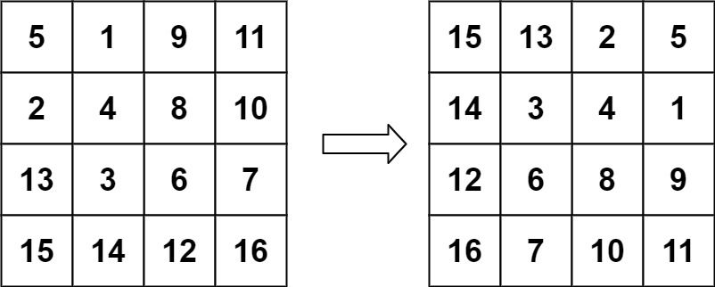

You are given an n x n 2D matrix representing an image, rotate the image by 90 degrees (clockwise).

You have to rotate the image in-place, which means you have to modify the input 2D matrix directly. DO NOT allocate another 2D matrix and do the rotation.


Example 1:

<pre>
Input: matrix = [[1,2,3],[4,5,6],[7,8,9]]
Output: [[7,4,1],[8,5,2],[9,6,3]]</pre>
Example 2:

<pre>
Input: matrix = [[5,1,9,11],[2,4,8,10],[13,3,6,7],[15,14,12,16]]
Output: [[15,13,2,5],[14,3,4,1],[12,6,8,9],[16,7,10,11]]
</pre>

Constraints:
- n == matrix.length == matrix[i].length
- 1 <= n <= 20
- -1000 <= matrix[i][j] <= 1000

```java
class Solution {
    public void rotate(int[][] matrix) {
        int n = matrix.length, m = matrix[0].length;
        int[][] result = new int[n][m];
        
        for(int j = m - 1; j >= 0; j--){
            for(int i = 0; i < n; i++){
                result[i][j] = matrix[n - 1 - j][i];
            }
        }
        
        // copy to org array
        for(int i = 0; i < n; i++){
            for(int j = 0; j < n; j++){
                matrix[i][j] = result[i][j];
            }
        }
    }
}
```