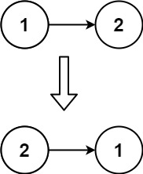

Given the head of a singly linked list, reverse the list, and return the reversed list.

Example 1:

<pre>
Input: head = [1,2,3,4,5]
Output: [5,4,3,2,1]
</pre>

Example 2:


<pre>
Input: head = [1,2]
Output: [2,1]
</pre>

Example 3:
<pre>
Input: head = []
Output: []
</pre>

Constraints:
- The number of nodes in the list is the range [0, 5000].
- -5000 <= Node.val <= 5000

Follow up: A linked list can be reversed either iteratively or recursively. Could you implement both?

```java
/**
 * Definition for singly-linked list.
 * public class ListNode {
 *     int val;
 *     ListNode next;
 *     ListNode() {}
 *     ListNode(int val) { this.val = val; }
 *     ListNode(int val, ListNode next) { this.val = val; this.next = next; }
 * }
 */
class Solution {
    public ListNode reverseList(ListNode head) {
        ListNode prev = null, next = null, cur = head;
        while( cur != null ){
            next = cur.next;
            cur.next = prev;
            prev = cur;
            cur = next;
        }
        
        return prev;
    }
}
```